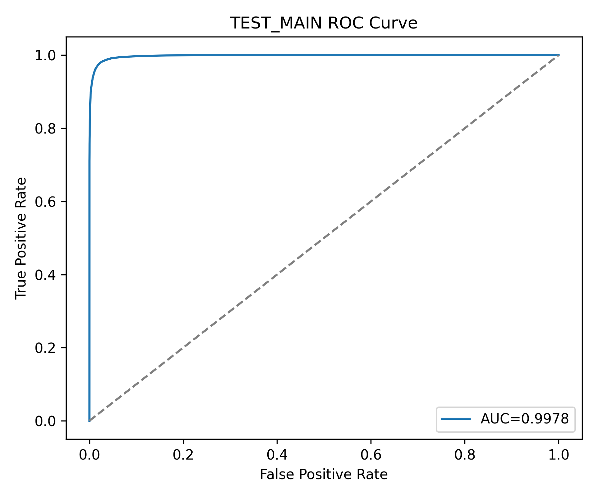
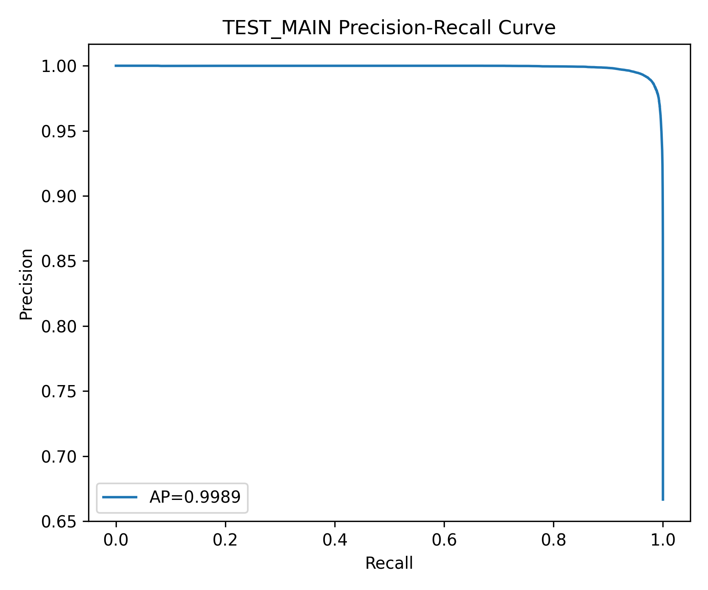
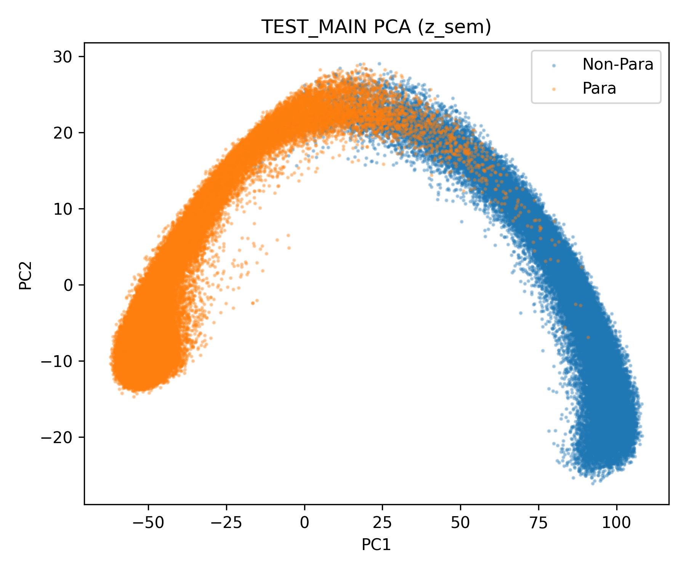
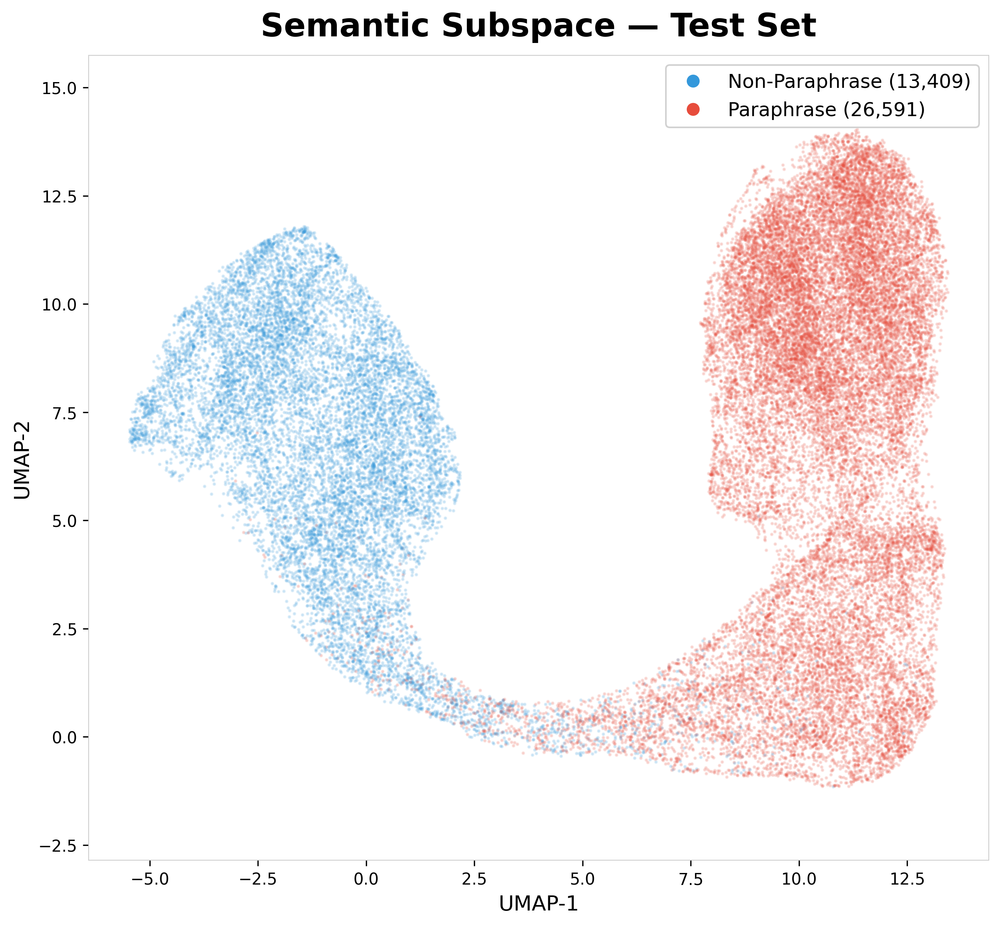
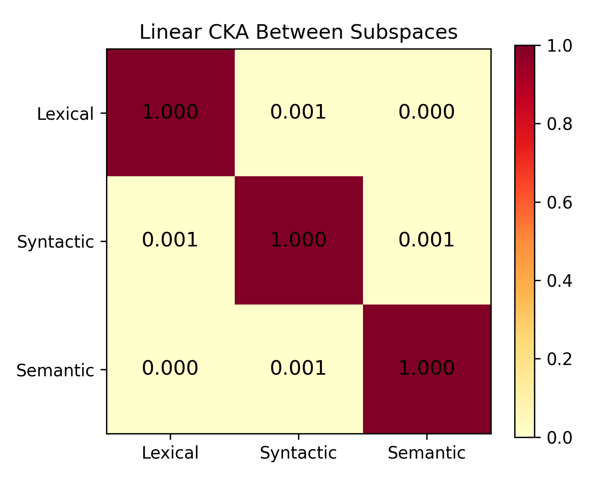

# Hierarchical Attention Transformer for Paraphrase Detection

A hierarchical transformer architecture that explicitly disentangles **lexical, syntactic, and semantic representations** for robust paraphrase detection and analysis.

This repository contains:

- model evaluation artifacts
- experimental plots
- analysis logs
- LLM paraphrase benchmark results

Pretrained models are available on Hugging Face.

Hugging Face Model Repository  
https://huggingface.co/GOVINDFROM/Hierarchical-Attention-Transformer

---

# Model Overview

The model learns **three specialized representation subspaces**

• lexical representation  
• syntactic representation  
• semantic representation  

These are processed using hierarchical attention and fused using a gated meta-classifier.

Encoders used:

- microsoft/deberta-v3-base  
- roberta-base  

The architecture performs

- disentangled projection into lexical, syntactic and semantic subspaces  
- additive attention pooling  
- cross-attention semantic interaction between sentence pairs  
- gated bilinear fusion  
- meta classifier for final decision

This structure enables **interpretable paraphrase reasoning**.

---

# Main Results

## Overall Model Performance

| Model | Split | F1 | Accuracy | Precision | Recall | AUC ROC | AUC PR | MCC |
|------|------|------|------|------|------|------|------|------|
| Main Hierarchical Model | Test | **0.9846** | **0.9794** | 0.9825 | 0.9867 | 0.9978 | 0.9989 | 0.9536 |
| Single Encoder A | Test | 0.9661 | 0.9547 | 0.9624 | 0.9699 | 0.9913 | 0.9958 | 0.8977 |
| Single Encoder B | Test | 0.9619 | 0.9488 | 0.9541 | 0.9699 | 0.9898 | 0.9950 | 0.8841 |
| Fusion Without Disentanglement | Test | 0.9715 | 0.9619 | 0.9681 | 0.9750 | 0.9936 | 0.9968 | 0.9140 |
| Majority Baseline | Test | 0.80 | 0.67 | 0.67 | 1.00 | 0.50 | 0.67 | 0.00 |

The hierarchical disentangled architecture significantly improves over single encoder and naive fusion baselines.

---

# Key Visualizations

## ROC Curve

## Precision Recall Curve

## PCA Representation (Semantic Subspace)

## UMAP Representation

## CKA Subspace Disentanglement

These plots illustrate

- strong separability of paraphrase classes  
- disentangled subspace representations  
- stable decision boundaries

---

# LLM Paraphrase Benchmark

The model was evaluated against paraphrases generated by multiple large language models.

Models tested:

- Claude Haiku 3.5  
- Claude Opus  
- Claude Sonnet 4.5  
- GPT 5  
- Grok 4  
- Llama 4  

Total paraphrase samples: 60

---

## Detection Performance

Overall detection rate:

**100 percent**

Average confidence:

**1.0000**

All LLM paraphrases were correctly identified.

---

## Surface Paraphrase Metrics

| Model | Jaccard | Novel Word Ratio | Edit Distance |
|------|------|------|------|
| Claude Haiku 3.5 | 0.247 | 0.566 | 0.753 |
| Claude Opus | 0.390 | 0.411 | 0.573 |
| Claude Sonnet 4.5 | 0.474 | 0.328 | 0.503 |
| GPT 5 | 0.501 | 0.285 | 0.472 |
| Grok 4 | 0.370 | 0.398 | 0.569 |
| Llama 4 | 0.405 | 0.361 | 0.563 |

The benchmark reveals varying paraphrase styles ranging from heavy lexical rewriting to structural reformulation.

---

## Key Finding

Across all models, the **semantic subspace is the weakest detection head**, indicating that LLM paraphrases primarily preserve semantic structure while modifying lexical and syntactic form.

